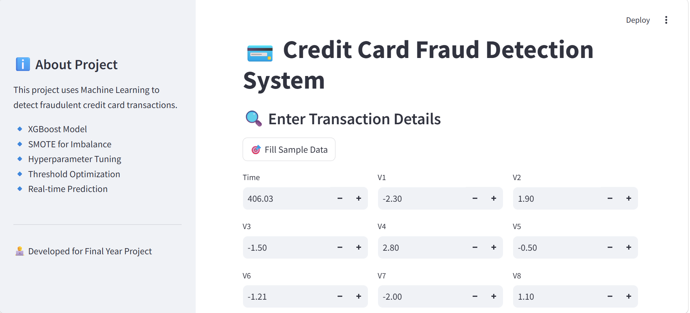

# 💳 Credit Card Fraud Detection System

## 📌 Project Overview

This project aims to detect fraudulent credit card transactions using Machine Learning techniques. Due to the highly imbalanced nature of the dataset, advanced methods like SMOTE and XGBoost are used to improve model performance.

The system is deployed using Streamlit to provide a real-time, user-friendly web interface for fraud prediction.

---

## 🚀 Features

* 🔍 Detects fraudulent transactions with high accuracy
* ⚡ Real-time prediction using Streamlit UI
* 📊 Data visualization and insights
* 🤖 Advanced ML model (XGBoost)
* ⚖️ Handles imbalanced data using SMOTE
* 🔎 Model explainability using SHAP (optional)

---

## 🧠 Machine Learning Workflow

1. Data Collection
2. Data Preprocessing
3. Exploratory Data Analysis (EDA)
4. Handling Imbalanced Data (SMOTE)
5. Model Training (XGBoost)
6. Model Evaluation (ROC-AUC, Precision, Recall)
7. Model Saving (Joblib)
8. Deployment (Streamlit)

---

## 📊 Model Performance

* ✅ ROC-AUC Score: **0.974**
* ✅ High Precision & Balanced Performance
* ⚠️ Optimized Threshold: **0.9609** (can be tuned based on use case)

---

## 🛠️ Tech Stack

* Python
* Pandas, NumPy
* Scikit-learn
* XGBoost
* Matplotlib, Seaborn
* Streamlit
* Imbalanced-learn

---

## 📂 Project Structure

```
Credit-Card-Fraud-Detection/
│
├── creditcard.csv
│   
├── model.pkl
├── scaler.pkl  
│   
├── app.py
├── requirements.txt
├── README.md
└── notebook.ipynb
```

---

## ⚙️ Installation & Setup

### 1️⃣ Clone Repository

```bash
git clone https://github.com/SanjuVerma123/Credit-Card-Fraud-Detection-System-.git
cd Credit-Card-Fraud-Detection-System-
```

### 2️⃣ Create Virtual Environment

```bash
python -m venv venv
venv\Scripts\activate   # Windows
```

### 3️⃣ Install Dependencies

```bash
pip install -r requirements.txt
```

### 4️⃣ Run Application

```bash
streamlit run app.py
```

---

## 🖥️ Streamlit UI

* Input transaction details
* Predict fraud probability
* Display result (Fraud / Not Fraud)

---

## 📈 Sample Input Features

* Time
* Amount
* V1 to V28 (PCA transformed features)

---

## 📸 Application Screenshot


## ⚠️ Challenges

* Highly imbalanced dataset
* Fraud detection requires high recall
* Threshold tuning is critical

---

## 🔥 Future Improvements

* ✅ Hyperparameter tuning
* ✅ Real-time API integration
* ✅ Deep Learning models
* ✅ Dashboard enhancements
* ✅ Deployment on cloud (AWS / GCP)

---

## 📌 Use Cases

* Banking fraud detection
* Online transaction monitoring
* Financial risk management

---
## 🔗 Connect With Me
* 1. 💼 LinkedIn: [Linkedin Profile](https://www.linkedin.com/in/sanju123)
* 2. 💻 GitHub: [GitHub Profile](https://github.com/SanjuVerma123)

## 👨‍💻 Author

**SANJU VERMA (Data Analyst/Data Science Student)**

---

## ⭐ If you like this project

Give it a ⭐ on GitHub and share with others!
